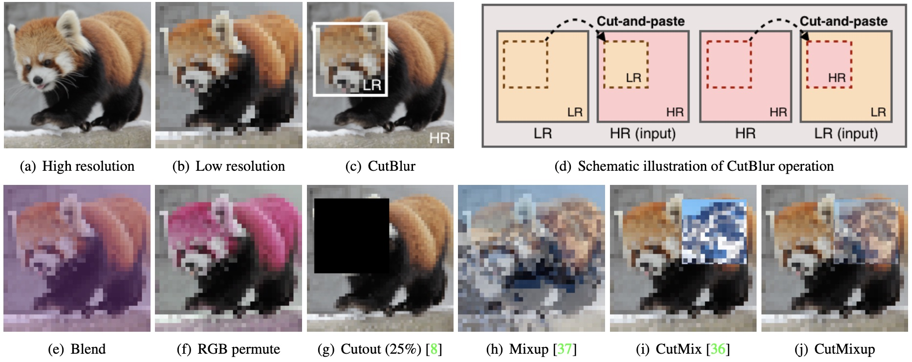

## Rethinking Data Augmentation for Image Super-resolution (CVPR 2020)
<p align="left"></p>

This repository provides the official PyTorch implementation of the following paper:
> **Rethinking Data Augmentation for Image Super-resolution: A Comprehensive Analysis and a New Strategy**<br>
> [Jaejun Yoo](https://www.linkedin.com/in/jaejunyoo/)<sup>\*1</sup>, [Namhyuk Ahn](https://nmhkahn.github.io)<sup>\*2</sup>, [Kyung-Ah Sohn](https://sites.google.com/site/kasohn/home)<sup>2</sup><br>
> <sup>*</sup> indicates equal contribution. Most work was done in NAVER Corp.<br>
> <sup>1</sup> EPFL<br>
> <sup>2</sup> Ajou University<br>
> [https://arxiv.org/abs/2004.00448](https://arxiv.org/abs/2004.00448)<br>
>
> **Abstract:** *Data augmentation is an effective way to improve the performance of deep networks. Unfortunately, current methods are mostly developed for high-level vision tasks (e.g., classification) and few are studied for low-level vision tasks (e.g., image restoration). In this paper, we provide a comprehensive analysis of the existing augmentation methods applied to the super-resolution task. We find that the methods discarding or manipulating the pixels or features too much hamper the image restoration, where the spatial relationship is very important. Based on our analyses, we propose **CutBlur** that cuts a low-resolution patch and pastes it to the corresponding high-resolution image region and vice versa. The key intuition of CutBlur is to enable a model to learn not only "how" but also "where" to super-resolve an image. By doing so, the model can understand "how much", instead of blindly learning to apply super-resolution to every given pixel. Our method consistently and significantly improves the performance across various scenarios, especially when the model size is big and the data is collected under real-world environments. We also show that our method improves other low-level vision tasks, such as denoising and compression artifact removal.*

### 0. Requirement
Simpy run:
```shell
pip3 install -r requirements.txt
```

### 1. Quick Start (Demo)
You can test our models with any images. Place images in `./input` directory and run the below script.<br>
Before executing the script, please download the pretrained model on [CutBlur_model](https://drive.google.com/open?id=1yMnIaNJX2eAhDNbTHhxAptm1dpSng2oR) and change the `--model` and `--pretrain` arguments appropriately.

```shell
python inference.py \
    --model [EDSR|RCAN|CARN] \
    --pretrain <path_of_pretrained_model> \
    --dataset_root ./input \
    --save_root ./output
```

We also provide a [demo](./example/demo_hr_inputting.ipynb) to visualize how the mixture of augmentation (MoA) prevent the SR model from over-sharpening.

### 2. Dataset
#### DIV2K
We use the [DIV2K](https://data.vision.ee.ethz.ch/cvl/DIV2K/) dataset to train the model. Download and unpack the tar file any directory you want.<br>
**Important:** For the DIV2K dataset only, all the train and valid images should be placed in the `DIV2K_train_HR` and `DIV2K_train_LR_bicubic` directories (We parse train and valid images using `--div2k_range` argument).

#### SR Benchmark
For the benchmark dataset used in the paper (Set14, Urban100, and manga109), we provide original images on [here](https://drive.google.com/open?id=1b6vhLVjdQFVDMVCokfI1hmlwA_MVktu4).

#### RealSR
We use the [RealSR](https://github.com/csjcai/RealSR) dataset (version 1). In the paper, we utilized both Canon and Nikon images for train and test.

### 3. Evaluate Pre-trained Models
For the folks who want to compare our result, we provide [our result](https://drive.google.com/open?id=1gGZuDfMJvD3ZUJSsQYVXREtLe_pUidms) generated on the RealSR and SR benchmark dataset.

We present an example script to evaluate the pretrained model below:

```shell
python main.py \
    --dataset [DIV2K_SR|RealSR|Set14_SR|Urban100_SR|manga109_SR] \
    --model [EDSR|RCAN|CARN] \
    --pretrain <path_of_pretrained_model> \
    --dataset_root <directory_of_dataset> \
    --save_root ./output
    --test_only
```

For `--dataset` argument, `_SR` postfix is required to identify the task among SR, DN and JPEG restoration.<br>
And if you evaluate on the `DIV2K_SR`, please add `--div2k_range 1-800/801-900` argument to specify the range of the images you use.

Note that, `[DIV2K, Set14_SR, Urban100_SR, manga109_SR]` have to be evaluate using the model trained on the DIV2K dataset (e.g. `DIV2K_EDSR_moa.pt`) while `[RealSR]` via the model with RealSR dataset (e.g. `RealSR_EDSR_moa.pt`).

### 4. Train Models
#### DIV2K (bicubic)
To achieve the result in the paper, X2 scale pretraining is necessary.
First, train the model on the X2 scale as below:
```shell
python main.py \
    --use_moa \
    --model [EDSR|RCAN|CARN] \
    --dataset DIV2K_SR \
    --div2k_range 1-800/801-810 \
    --scale 2 \
    --dataset_root <directory_of_dataset>
```
If you want to train the baseline model, discard `--use_moa` option.

By default, the trained model will be saved in `./pt` directory. And since evaluating the whole valid images takes a lot of time, we just validated the model on the first ten images during training.

Then, fine-tune the trained model on the X4 scale:
```shell
python main.py \
    --use_moa \
    --model [EDSR|RCAN|CARN] \
    --dataset DIV2K_SR \
    --div2k_range 1-800/801-810 \
    --scale 4 \
    --pretrain <path_of_pretrained_model> \
    --dataset_root <directory_of_dataset>
```
Please see the `option.py` for more detailed options.

#### RealSR
Simply run this code:
```shell
python main.py \
    --use_moa \
    --model [EDSR|RCAN|CARN] \
    --dataset RealSR \
    --scale 4 --camera all \
    --dataset_root <directory_of_dataset>
```

### Updates
- **02 Apr, 2020**: Initial upload.

### License
```
Copyright (c) 2020-present NAVER Corp.

Permission is hereby granted, free of charge, to any person obtaining a copy
of this software and associated documentation files (the "Software"), to deal
in the Software without restriction, including without limitation the rights
to use, copy, modify, merge, publish, distribute, sublicense, and/or sell
copies of the Software, and to permit persons to whom the Software is
furnished to do so, subject to the following conditions:

The above copyright notice and this permission notice shall be included in
all copies or substantial portions of the Software.

THE SOFTWARE IS PROVIDED "AS IS", WITHOUT WARRANTY OF ANY KIND, EXPRESS OR
IMPLIED, INCLUDING BUT NOT LIMITED TO THE WARRANTIES OF MERCHANTABILITY,
FITNESS FOR A PARTICULAR PURPOSE AND NONINFRINGEMENT.  IN NO EVENT SHALL THE
AUTHORS OR COPYRIGHT HOLDERS BE LIABLE FOR ANY CLAIM, DAMAGES OR OTHER
LIABILITY, WHETHER IN AN ACTION OF CONTRACT, TORT OR OTHERWISE, ARISING FROM,
OUT OF OR IN CONNECTION WITH THE SOFTWARE OR THE USE OR OTHER DEALINGS IN
THE SOFTWARE.
```

### Citation
```
@article{yoo2020rethinking,
  title={Rethinking Data Augmentation for Image Super-resolution: A Comprehensive Analysis and a New Strategy},
  author={Yoo, Jaejun and Ahn, Namhyuk and Sohn, Kyung-Ah},
  journal={arXiv preprint arXiv:2004.00448},
  year={2020}
}
```
